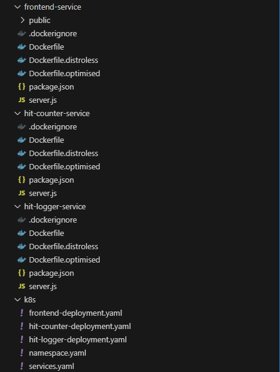

Here is a technically refined and structured description of your Node.js microservices application, designed for deployment on Azure Kubernetes Service (AKS):

## Node.js Microservices Architecture for Hit Counter Application on Azure AKS

**Overview**

This application consists of three independent Node.js microservices, each with a distinct role. The services communicate over HTTP and leverage a cloud-native Azure database (such as Azure SQL or Azure Cosmos DB) for persistent storage. The solution is architected for containerization and deployment on Azure Kubernetes Service (AKS)

**Microservices Breakdown**

- **Landing Page Service (UI Service):**
    
    - Provides a simple web interface with a "Hit Here" button and displays the total number of hits.
        
    - On button click, it sends a request to the Hit Logger Service to record the event.
        
    - Periodically (or on page load), it fetches the current hit count from the Hit Count Service to display to users.
        
- **Hit Logger Service:**
    
    - Exposes an API endpoint to receive hit events from the UI Service.
        
    - Records each hit event in an Azure-managed database (either Azure SQL Database or Azure Cosmos DB, depending on requirements and scalability needs)
        
    - Ensures data integrity and supports concurrent updates.
        
- **Hit Count Service:**
    
    - Exposes an API endpoint to retrieve the total number of recorded hits.
        
    - Queries the database to compute and return the current hit count.
        
    - The UI Service invokes this endpoint to display the updated hit count to users.
        

**Technical Considerations**

- Each service runs in its own container and is deployed as a separate Kubernetes deployment and service within the AKS cluster
    
- Internal communication between services is managed via Kubernetes service discovery.
    
- The database connection details are securely managed using Kubernetes secrets and environment variables.
    
- The system is designed for scalability, allowing each microservice to scale independently based on demand
    
- Azure resources such as Azure Container Registry (for storing container images), Azure Cosmos DB/Azure SQL (for data persistence), and Azure Monitor (for logging and telemetry) are integrated as part of the overall solution
    

**Example Directory Structure**

text

**Deployment Approach**

- Containerize each service using Docker.
    
- Push images to Azure Container Registry.
    
- Define Kubernetes manifests for each service and deploy them to AKS.
    
- Provision and configure the chosen Azure database service.
    
- Use Kubernetes ConfigMaps and Secrets for configuration and sensitive data management.
    
- Set up ingress or API gateway for external access to the UI service
    

**Summary Table**

|Service Name|Functionality|Exposed API|Azure Integration|
|---|---|---|---|
|Landing Page Service|UI, triggers hit, displays count|Web UI|Ingress, AKS|
|Hit Logger Service|Records hits in database|POST /log-hit|Azure SQL/Cosmos DB|
|Hit Count Service|Retrieves total hit count|GET /hit-count|Azure SQL/Cosmos DB|

This architecture ensures modularity, scalability, and ease of management, aligning with best practices for microservices deployment on Azure Kubernetes Service